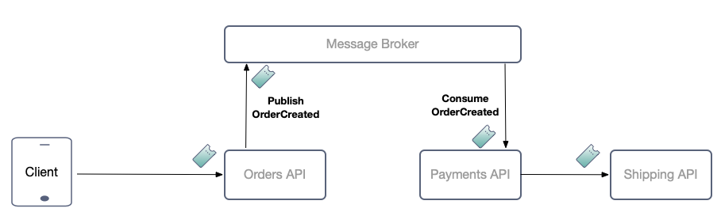
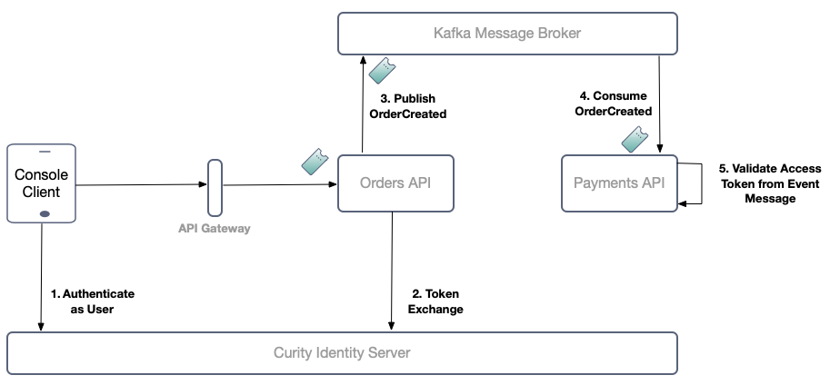
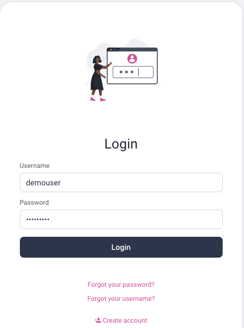

# Kafka Zero Trust

A project to demonstrate event based messaging with zero trust.\
Before processing every event message the consumer API validates a JWT access token.\
JWT access tokens used by consumers can be long lived but have reduced permissions.\
Each long lived JWT access token is bound to a specific event message.

## Example Microservices Scenario

To demonstrate the approach, the code example uses a flow where a user facing app triggers a purchase.\
This results in a number of logical microservice calls, chained in a workflow:


Some physical calls may be routed via a message broker such as [Apache Kafka](https://kafka.apache.org/).\
The code example provides a method for securely forwarding access tokens between services via the message broker:



This secures event based messages received by APIs from potential threats inside the cluster.

## Components

This repo focuses on zero trust routing of event messages between the order and payment microservices.\
The following diagram illustrates the components involved and the key behaviors:



The following URLs are used:

| Component | Location |
| --------- | -------- |
| API Gateway | http://localhost:3000 |
| Orders API | http://localhost:3000/orders |
| Payments API | http://localhost:3000/payments |
| Curity Identity Server Runtime | http://localhost:8443 |
| Curity Identity Server Admin UI | http://localhost:6749 |

## Prerequisites

The solution provides two simple Node.js microservices and some deployment resources.\
First ensure that these prerequisites are installed:

- [Docker](https://www.docker.com/products/docker-desktop/)
- [Node.js](https://nodejs.org/en/download/)
- [jq](https://github.com/stedolan/jq)

Also get a `license.json` file for the Curity Identity Server and copy it to the `idsvr` folder:

- If required sign up to the [Curity Developer Portal](https://developer.curity.io/) with your Github account.
- You can get a [Free Community Edition License](https://curity.io/product/community/) if you are new to the Curity Identity Server.

## Run the Code

Run the following script to run the APIs locally and all other components in a Docker Compose network.\
On the initial run it will take some minutes to download large third party containers:

```bash
./deploy.sh
```

Or run the following scripts to also deploy the APIs to the Docker Compose network:

```bash
./build.sh DEPLOYED
./deploy.sh DEPLOYED
```

Then run a minimal console client:

```bash
cd console-client
npm install
npm start
```

The client will run a code flow that opens the system browser, to get a user level access token.\
Sign in as `demouser / Password1` to create an order and trigger event publishing:



## Data and Identity Flow

The client application sends an example order from the end user to the Orders API.\
This includes an access token that is verified in the standard way.

```json
{
  "items":
  [
    {
      "itemID": 1,
      "quantity": 1
    },
    {
      "itemID": 2,
      "quantity": 2
    }
  ]
}
```

The Orders API then saves the transaction in its own data as follows:

```json
{
    "orderTransactionID": "22fc326d-23e4-5fc3-f803-e989854704e7",
    "userID": "2e1ba75dad2b62d8620ee9722caad54b02d7086edbd4c15529962ca26d04e103",
    "utcTime": "2022-07-06T09:23:19.577Z",
    "items": [
      {
        "itemID": 1,
        "quantity": 1,
        "price": 100
      },
      {
        "itemID": 2,
        "quantity": 2,
        "price": 100
      }
    ]
  }
```

The Orders API then performs a token exchange and publishes an order event with the following structure:

```json
{
  "accessToken": "eyJraWQiOiItNDc4MTAzOTYyIiwieDV0IjoiSWlHYkRYQ1V3Yl9sYVkzTm1fRlpWYkhWbElZIiwiYWxnIjoiUlMyNTYifQ.eyJqdGkiOiI5NGQxNzIzYy03MjAwLTQzZjctYjAwZS1lNDk5ZDU5Y2JiNGIiLCJkZWxlZ2F0aW9uSWQiOiI5ZDFiMTc0Ni1jNzgzLTRiZjQtYjc5NS00N2MzYjdhYmY3NWIiLCJleHAiOjE2NTcwOTk5NzgsIm5iZiI6MTY1NzA5OTY3OCwic2NvcGUiOiJzaGlwcGluZyBwYXltZW50cyIsImlzcyI6Imh0dHA6Ly9sb2NhbGhvc3Q6ODQ0My9vYXV0aC92Mi9vYXV0aC1hbm9ueW1vdXMiLCJzdWIiOiIyZTFiYTc1ZGFkMmI2MmQ4NjIwZWU5NzIyY2FhZDU0YjAyZDcwODZlZGJkNGMxNTUyOTk2MmNhMjZkMDRlMTAzIiwiYXVkIjoiYXBpLmV4YW1wbGUuY29tIiwiaWF0IjoxNjU3MDk5Njc4LCJwdXJwb3NlIjoiYWNjZXNzX3Rva2VuIiwib3JkZXJfdHJhbnNhY3Rpb25faWQiOiIyMmZjMzI2ZC0yM2U0LTVmYzMtZjgwMy1lOTg5ODU0NzA0ZTciLCJyZXF1ZXN0X2NvbnRlbnRfaGFzaCI6ImVlOGQ0YmQyNTc4OTU3OGMyZGZmY2ZjMTFjNjNiNDJjNjljMTQ5YWY1MGU4MGRjNTkyYjViZGY1NTJhZTk0YWIifQ.EaMXYEfw6bpSHMk2sjPYAjKJgVxDHyeaHSutEPveQcdND5sr9TiDs_Tx6hjpKcqcbs3Bgq-nU-RNzz__DTQpkSjkoOdAyb37TMY-qAtOPtApBqCXCHRfmC-ndfc1rWtSyO7SCbSsJHZwVFeJOH6PokK9dFxYuVJ0C3yuAAaVTUWuig_Mr2bMAsGu52joDMnf9zx3NKxKBBqKCFuIOj9olKq5GREvIeWWKRCiBXj0kafmpQQB03G9OLS5x2Kl3EChYBttkmoqiHMNPU3QYYLRQNbuX2WFEQhxIWLOdMbYXW_Pn8pUkd3Q08VkpDbaAjp6PrwqeSyGFhTWs1SHZN_VPQ",
  "payload": {
    "orderTransactionID": "22fc326d-23e4-5fc3-f803-e989854704e7",
    "userID": "2e1ba75dad2b62d8620ee9722caad54b02d7086edbd4c15529962ca26d04e103",
    "utcTime": "2022-07-06T09:23:19.577Z",
    "items": [
      {
        "itemID": 1,
        "quantity": 1,
        "price": 100
      },
      {
        "itemID": 2,
        "quantity": 2,
        "price": 100
      }
    ]
  }
}
```

The Payments API consumes the event and validates the JWT access token before processing it.\
The Payments API then saves the transaction in its own data in the following format.\
The user identity has flowed between microservices in a digitally verifiable way and is included in auditing:

```json
{
    "paymentTransactionID": "544809de-e3a1-e1b5-bb98-894546529073",
    "orderTransactionID": "22fc326d-23e4-5fc3-f803-e989854704e7",
    "userID": "2e1ba75dad2b62d8620ee9722caad54b02d7086edbd4c15529962ca26d04e103",
    "utcTime": "2022-07-06T09:23:19.884Z",
    "amount": 200
  }
```

## Security

The client gets an initial short lived access token with these scopes:

```json
{
  "jti": "94d1723c-7200-43f7-b00e-e499d59cbb4b",
  "delegationId": "9d1b1746-c783-4bf4-b795-47c3b7abf75b",
  "exp": 1657099978,
  "nbf": 1657099678,
  "scope": "orders trigger_payments",
  "iss": "http://localhost:8443/oauth/v2/oauth-anonymous",
  "sub": "2e1ba75dad2b62d8620ee9722caad54b02d7086edbd4c15529962ca26d04e103",
  "aud": "api.example.com",
  "iat": 1657099678,
  "purpose": "access_token"
}
```

The Orders API makes a token exchange request to swap the client access token for a longer lived access token.\
This prevents potential JWT expiry problems in the Payments API and has reduced privileges.

```text
POST http://localhost:8443/oauth/v2/oauth-token

grant_type=https://curity.se/grant/accesstoken&
client_id=orders-api-client&
client_secret=Password1&
scope=payments&
token=[client_access_token]&
order_transaction_id=22fc326d-23e4-5fc3-f803-e989854704e7&
event_name=OrderCreated&
event_payload_hash=ee8d4bd25789578c2dffcfc11c63b42c69c149af50e80dc592b5bdf552ae94ab
```

The Payments API then receives the following JWT access token payload.\
Scopes are reduced and extra claims added for authorization.\
The Payments API validates the JWT before accepting the message.

```json
{
  "jti": "94d1723c-7200-43f7-b00e-e499d59cbb4b",
  "delegationId": "9d1b1746-c783-4bf4-b795-47c3b7abf75b",
  "exp": 1657099978,
  "nbf": 1657099678,
  "scope": "trigger_payments",
  "iss": "http://localhost:8443/oauth/v2/oauth-anonymous",
  "sub": "2e1ba75dad2b62d8620ee9722caad54b02d7086edbd4c15529962ca26d04e103",
  "aud": "api.example.com",
  "iat": 1657099678,
  "purpose": "access_token",
  "order_transaction_id": "22fc326d-23e4-5fc3-f803-e989854704e7",
  "event_name": "OrderCreated",
  "event_payload_hash": "ee8d4bd25789578c2dffcfc11c63b42c69c149af50e80dc592b5bdf552ae94ab"
}
```

The Payments API also verifies that the event message matches the access token.\
This ensures that any tampered or malicious event messages are rejected:

- The `order_transaction_id` must match that in the event payload
- The `event_payload_hash` must match the hash of the event payload

## Message Replays

If an event message is replayed, then the transaction will already exist in the Payments API.\
Therefore it will not be reprocessed, so duplicate transactions can be avoided.\
Meanwhile, long lived access tokens in event messages can be used with data flow patterns such as event sourcing.

## Further Information

See the following Curity website resources for further details:

- [Zero Trust API Events Article](https://curity.io/resources/learn/zero-trust-api-events)
- [Kafka Zero Trust Code Example](https://curity.io/resources/learn/api-using-zero-trust-events)

Please visit [curity.io](https://curity.io/) for more information about the Curity Identity Server.
