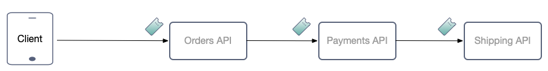
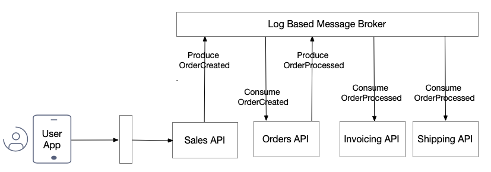
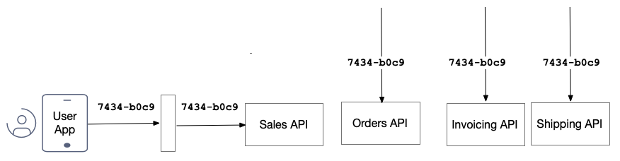

# Kafka Zero Trust

A demo project for exploring a more complete zero trust picture.\
Companies use systems such as Kafka for data flow patterns, but how best to secure those messages?

## Example Microservices Scenario

An app based on a user buying something needs to call multiple microservices.\
A microservices based system might do this:



Some difficult areas exist when dealing with multiple microservices:

| Area | Description |
| ---- | ----------- |
| Reliability | The system should be resilient to temporary unavailability of certain services |
| Data Integrity | In the event of retries, no duplicate data should be created |
| Event Security | Event based messages should be received securely, with no man in the middle risks |
| Message Replay | Messages should be replayable in the future |

## Event Based Solutions

Systems such as Kafka provide separation so that each microservice is easier to reason about.\
Data can flow reliably without the need for distributed transactions:



The initial call to the Sales API only writes to an event store, so it is easy to start processing transactionally.\
This type of setup also copes with some microservices being temporarily offline.

## Message Data

To prevent data duplication the original client may send a request ID that flows to each microservice.\
Each API could then check for this request ID in existing data with fairly simple code.



Messages should also be digitally signed so that they cannot be tampered with by a man in the middle.\
Messages should also be able to convey a JWT digital identity containing scopes and claims.\
Messages should have a version to enable APIs to apply different policies over time.

## API Behavior

The demo project could consist of a number of simple operations and in-memory storage:

| API | Operation | Called Via |
| --- | --------- | ---------- |
| Sales | Submit Order | HTTP |
| Sales | List Submitted Orders | HTTP |
| Orders | Create Order | Event |
| Orders | List Orders | HTTP |
| Invoicing | Create Invoice | Event |
| Invoicing | List Invoiced Orders | HTTP |
| Shipping | Ship Order | Event |
| Shipping | List Shipped Orders | HTTP |

The demo APIs should use similar middleware to validate JWTs on both HTTP and event based requests.\
In both cases a claims principal should be created, and business logic should not care how the API was called.\
Authorization should take place when event messages are consumed, though this is not expected to fail.\
The API code from this repo is expected to be very simple, but the design is the hard part.

## Timing

99% of messages are processed immediately, though there are some 1% exceptions that need to be dealt with:

- A message could fail due to a bug and need to be replayed 24 hours later
- Event sourcing could be used, and all messages replayed a year later
- Authorization rules could have changed since the initial message

During message replays, JWTs could have expired or message signing keys could have been renewed.\
In some cases retries from the client may be possible, but usually the client will have gone away.\
For edge cases the security could perhaps be reduced, without affecting the 99% case?

## Demo Project

Some initial code has been stubbed out, to help us think how the repo should work.\
Run these commands to build code and spin up the system:

```bash
./build.sh
./deploy.sh
```

Then call deployed APIs to list data, and future data changing commands will trigger events:

```bash
curl http://localhost:3001
curl http://localhost:3002
curl http://localhost:3003
curl http://localhost:3004
```
