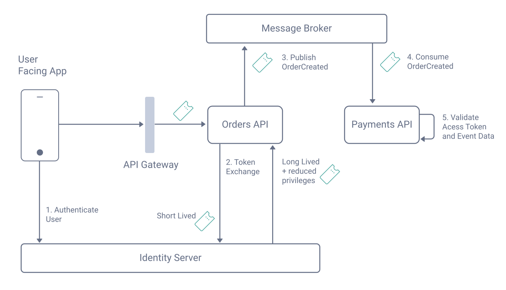

# Kafka Zero Trust

A project to demonstrate event based messaging between APIs with zero trust:

- Publishing APIs include a long lived reduced privilege access token in event messages
- Consuming APIs validate the access token before processing event messages
- Identity thus flows securely, and data integrity of event messages is also guaranteed

This code example uses [Apache Kafka](https://kafka.apache.org/) for event based messaging.

## Behavior Overview

To demonstrate the approach, the code example uses a flow where a user facing app triggers a purchase.\
The user facing app calls an Orders API which publishes an event to a message broker.\
A Payments API then consumes the event and makes additional security checks before processing the data.\
The following diagram illustrates the components involved and the key behaviors:



## Prerequisites

The solution provides two simple Node.js microservices and some deployment resources.\
First ensure that these prerequisites are installed:

- [Docker](https://www.docker.com/products/docker-desktop/)
- [Node.js](https://nodejs.org/en/download/)

Also get a `license.json` file for the Curity Identity Server and copy it to the `idsvr` folder:

- If required sign up to the [Curity Developer Portal](https://developer.curity.io/) with your Github account
- You can get a [Free Community Edition License](https://curity.io/product/community/) if you are new to the Curity Identity Server

## Run the Code

Execute these commands to run the APIs locally and all other components in a Docker Compose network.\
On the initial run it will take some minutes to download all third party containers:

```bash
./build.sh
./deploy.sh
```

Then run a minimal console client which acts as the user facing app:

```bash
cd console-client
npm install
npm start
```

The client will run a code flow that opens the system browser, to get a user level access token.\
Sign in as `demouser / Password1` to get the initial user level access token:


The console client then simply calls the Orders API to create an order transaction and exits.\
Meanwhile the Orders API raises a secure event consumed by the Payments API.

## URLs

The following external URLs are available on the development computer.\
The payments service and Apache Kafka run inside the cluster.

| Component | Location |
| --------- | -------- |
| API Gateway | http://localhost:3000 |
| Orders API | http://localhost:3000/orders |
| Curity Identity Server Runtime | http://localhost:8443 |
| Curity Identity Server Admin UI | http://localhost:6749 |

## Data and Identity Flow

The client application sends an example order such as the following to the Orders API.\
This request includes an access token that is verified in the standard way:

```json
{
  "items":
  [
    {
      "itemID": 3,
      "quantity": 3
    }
  ]
}
```

The Orders API then saves the transaction in its own data as follows:

```json
{
  "orderTransactionID": "1b6d215b-7ce2-4e0b-9079-f4e1266f57b1",
  "userID": "demouser",
  "utcTime": "2022-07-07T17:39:30.280Z",
  "items": [
    {
      "itemID": 3,
      "quantity": 3,
      "price": 100
    }
  ]
}
```

The Orders API then performs a token exchange and publishes an `OrderCreated` event with the following structure:

```json
{
  "accessToken": "eyJraWQiOiItMTcyNT ...",
  "payload": {
    "orderTransactionID": "1b6d215b-7ce2-4e0b-9079-f4e1266f57b1",
    "userID": "demouser",
    "utcTime": 1657215570280,
    "items": [
      {
        "itemID": 3,
        "quantity": 3,
        "price": 100
      }
    ]
  }
}
```

The Payments API consumes the event and validates the JWT access token before processing it.\
The Payments API then saves the transaction in its own data in the following format.\
The user identity has flowed between microservices in a digitally verifiable way, and can be audited:

```json
{
  "paymentTransactionID": "f093c858-d7c8-8ca4-2437-dbb6498c14b2",
  "orderTransactionID": "1b6d215b-7ce2-4e0b-9079-f4e1266f57b1",
  "userID": "demouser",
  "utcTime": "2022-07-07T17:39:31.444Z",
  "amount": 100
}
```

## Security and Tokens

The client gets an initial access token with a 15 minute expiry and these token properties:

```json
{
  "jti": "2038fb12-8089-4ebb-bca7-efdd179adc72",
  "delegationId": "e39a700d-3f3d-469e-a72f-aa02d55d5d54",
  "exp": 1657215870,
  "nbf": 1657215570,
  "scope": "openid profile orders",
  "iss": "http://localhost:8443/oauth/v2/oauth-anonymous",
  "sub": "demouser",
  "aud": "api.example.com",
  "iat": 1657215570,
  "purpose": "access_token"
}
```

The Orders API makes a token exchange request to with the original access token:

```text
POST http://localhost:8443/oauth/v2/oauth-token

grant_type=urn:ietf:params:oauth:grant-type:token-exchange
&client_id=orders-api-client
&client_secret=Password1
&subject_token=eyJraWQiOiItMTcyNTQxNzE2NyIsIng...
&subject_token_type=urn:ietf:params:oauth:token-type:access_token
&scope=payments
&audience=jobs.example.com
&transaction_id=1b6d215b-7ce2-4e0b-9079-f4e1266f57b1
&event_payload_hash=7e6d3d4b2608625f144f9c1a988da170504a368b647a6609ac4ec6c939496be1
```

The Payments API then receives the following JWT access token payload.\
The access token's audience and scope are updated and it has a 1 year lifetime.\
The last two token claims bind it to the specific event, as a mechansim to reduce token privileges:

```json
{
  "jti": "afa3d2b3-3b97-4a0a-9e31-ad8e69aac9ba",
  "delegationId": "e39a700d-3f3d-469e-a72f-aa02d55d5d54",
  "exp": 1688751570,
  "nbf": 1657215570,
  "scope": "payments",
  "iss": "http://localhost:8443/oauth/v2/oauth-anonymous",
  "sub": "demouser",
  "aud": "jobs.example.com",
  "iat": 1657215570,
  "purpose": "access_token",
  "transaction_id": "1b6d215b-7ce2-4e0b-9079-f4e1266f57b1",
  "event_payload_hash": "7e6d3d4b2608625f144f9c1a988da170504a368b647a6609ac4ec6c939496be1"
}
```

The Payments API only receives tokens with th async jobs audience at its messaging endpoints.\
The Payments API verifies that the event data matches that in the access token.\
A malicious party cannot publish events since they do not have access to the JWT signing private key.\
A malicious party cannot alter events since the event data would no longer match the claim in the JWT.

## Further Information

See the following Curity website resources for further details:

- [Zero Trust API Events Article](https://curity.io/resources/learn/zero-trust-api-events)
- [Kafka Zero Trust Code Example](https://curity.io/resources/learn/securing-api-events-using-jwts)

Please visit [curity.io](https://curity.io/) for more information about the Curity Identity Server.
